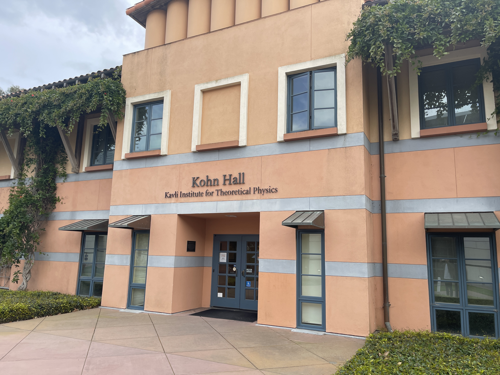
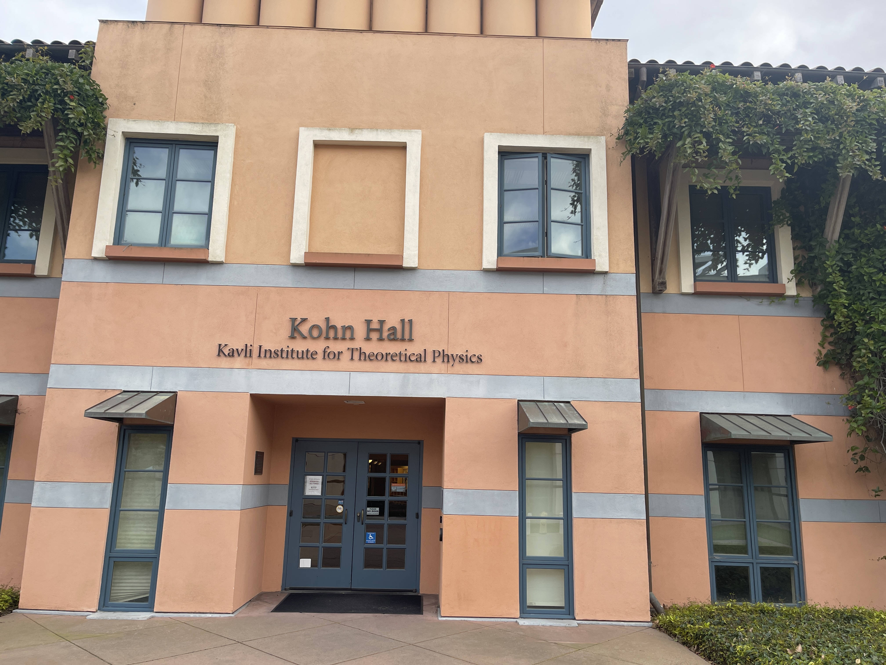
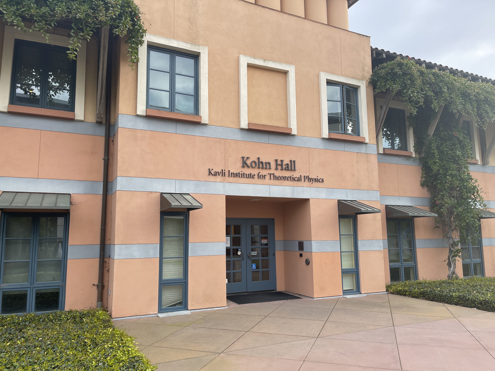
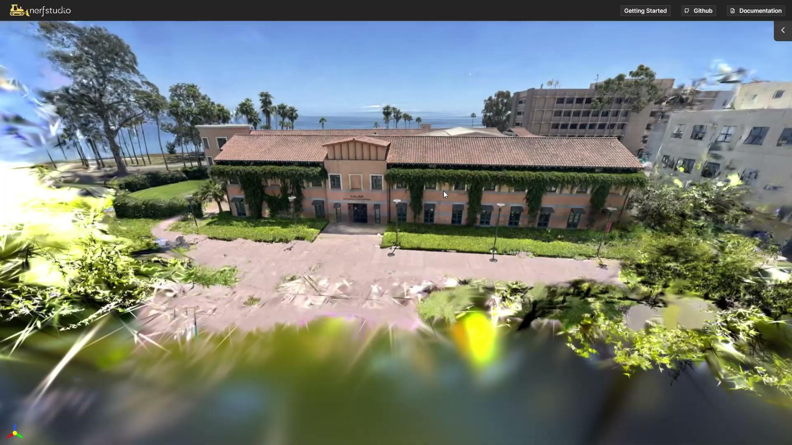

# End-to-End 3D Scene Reconstruction from Images

## Demo

### Input Examples

  
  
  

### Dense Point Cloud

### 3D Scene
<!-- [🎬 Demo Video](3D%20Scene%20Generation.mp4) -->

**Click the image above to watch the demo video of 3D Scene Generation**

## Overview
- Build a modular pipeline for 3D scene reconstruction from images  
- Implement feature extraction, matching,Structure-from-Motion (SfM)
- Integrate NeRF (via Nerfstudio) for final rendering  
- Generate visually compelling 3D structures from 2D inputs  

## Milestones

### Milestone 1: Manual Feature Extraction & Matching
- Manually select point correspondences across images  
- Compute homographies and validate transformations  
- Estimate the fundamental matrix and visualize epipolar geometry  

### Milestone 2: Automated Feature Extraction & Matching
- Implement automated feature extraction methods (SuperPoint, DISK, SIFT)  
- Apply RANSAC for outlier rejection  
<!-- - Generate `features.h5`, `matches.h5`, and `database.db`   -->

### Milestone 3: Camera Parameter Estimation & Point Cloud Generation
- Implement incremental Structure-from-Motion (SfM)  
- Estimate camera poses and reconstruct a sparse and dense point cloud    
<!-- - Analyze bundle adjustment performance   -->

### Milestone 4: Gaussian Splatting for 3D Scene Generation
- Render the reconstructed scene with NeRF (via Nerfstudio)  
<!-- - Experiment with kernel sizes, blending, and transparency  
- Compare visualization results under different settings   -->

